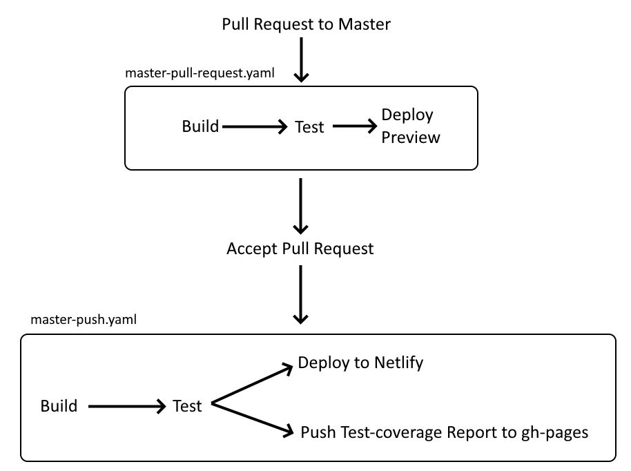

# ReptiMate

The project is for course SEP4 where we create an app for moitoring the environment inside terrariums.

Technologies used:
  - development: React, NX
  - styling: tailwindcss, ANT design
  - testing: Jest, RTL

## Links
- Website available on: https://reptimate.netlify.app/
- Test coverage available on: https://apetrackunit.github.io/lizards-inc-fe/2

Note: 
To use the deployed page, go to site settings, and set the 'Insecure content' to allow.
This is because the frontend is deployed on an https endpoint, but the backend is on a http endpoint.

## GIT rules 

Always use the name of the story (eg: "SFE-6/redesign-login-button").

## Development server

Run `nx serve ` for a dev server. Navigate to http://localhost:4200/. The app will automatically reload if you change any of the source files.

## Understand this workspace

Run `nx graph` to see a diagram of the dependencies of the projects.

## Workflows

## Dev team
This project was developed by 4th semester students of VIA University College - Software Technology Engineering: 
- Adam Petříček (315203)
- Gabriel Horžić (315204)
- Gergő Nádor (315279)
- Sofia Augustínová (315209)
